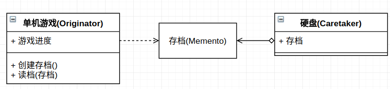

## 简单工厂模式(ch1)

给工厂需求的信息 , 简单工厂通过对信息进行case判断返回客户端需要的类

## 工厂方法模式(ch8)

相当于上例中有专门生产加法运算的工厂,专门生产减法运算的工厂.好处就是,在客户端创建同一个类的对象时,客户端不用反复给简单工厂同样的描述,工厂也不需要进行case判断

## 抽象工厂模式(ch15)

一系列行为的工厂. 对工厂模式再度进行封装. 比如与 运动行为相关的集合的工厂,与工作行为相关的集合的工厂.  容易导致代码量变得庞大

## 策略模式(ch2)

和简单工厂不同，不是返回工具，而是把工具放入Context中，客户端直接取使用工具后生成的结果.客户端直接放入自己需要那种算法的类,而不是工厂通过case判断.

当然,也可以和简单工厂模式结合使用, 在Context类中放个case,客户端同样输入字符串

## 装饰模式(ch6)

动态地给一个对象添加一些额外的职责,就添加功能来说, 装饰模式比生成子类更为灵活

一层层, 子类(Decorator)中又包括父类(Component)的对象, 类似嵌套,又类似单项链表. 所以是有序的

## 代理模式(ch7)

为其他对象提供一种代理以控制对这个对象的访问. 客户端无需知道实际执行的对象, 知道代理就可以了,代理需要知道实际执行的对象.

## 原型模式(ch9)

用原型实例制定创建对象的种类，并且通过拷贝这些原型创建新的对象.  就是通过clone()创建拥有类似条件的对象, 再在这个clone()的基础上在进行修改

## 模板模式(ch10)

定义一个操作中的算法的骨架, 而将一些步骤延迟到子类中, 从而使得子类可以不改变一个算法的结构即可重新定义某些步骤

## 外观模式(ch12)

为子系统中的一组接口提供一个一致的界面,让子系统更方便使用. 也就是把一系列操作封装起来,只给客户端提供给一个门面

## 建造者模式(ch13)

将一个复杂对象的构建与他的表示分离，使得同样的构建过程可以创建不同的表示. 

Factory 是创建一个工具，Builder是规定了各个步骤. 而且Builder需要一个指挥者(Director)来执行这些流程

## 观察者模式(ch14)

定义一种一对多的依赖关系, 让多个观察者同时监听某某一个主题对象, 当这个主题状态发生变化时,通知所有观察者对象.说白了就是观察的对象发生变化时统一调用订阅者列表的某个方法

## 状态模式(ch16)

当一个对象的内在状态改变时允许改变其行为, 这个对象看起来像是改变了其类

把复杂的if else简单化, 在客户端直接放入该状态可能对应的行为的类 而不是直接在客户端进行ifelse判断

当一个对象的行为取决与他的状态, 实际上依然是像ifelse那样从前开始判断, 不符合时放入下一个状态

责任链模式的,每个只能决定一件事版本?

## 适配器模式(ch17)

将一个类的借口转换成用户希望的另一个接口．是的原本不兼容的类能一起工作

就是客户端调用接口的对象, 而该对象实际是调用了和该接口无关的类,

## 备忘录模式(ch18)

在不破坏封装的前提下，捕获一个对象的内部状态，并在该对象之外保存这个状态，以便后期恢复到这个状态

- Originator :创造备份 和 还原备份
- Memento : 备份，类似于实体类
- Caretaker：保存Originator创造的备份

## 组合模式(ch19)

将对象组合成树形结构表示'部分-整体'的层次结构.组合模式使得用户对单个对象和组合对象的使用具有一致性

反正就是树结构, 每个节点中包含子节点(也可以是叶节点)的集合. 就算树中有相同类, 也能通过此方式来特定优先级

## 迭代模式(ch20)

就是Java中的Iterator那种

## 单例模式(ch21)

保证一个类仅有一个实例，　并提供一个访问它的全局访问点

把构造方法设为private,提供一个返回自身实例的方法

饿汗式 :多线程下也是安全的，类加载时就会被被实例化，占用内存

懒汉式：返回自身实例的方法被调用时，若还没被实例化就实例化后病返回，　多线程时会出现问题

懒汉式的双重锁定　:　用两个synchronized (Singleton.class)｛｝解决懒汉式在多线程下的问题

## 桥接模式(ch22)

当结构复杂 (不为树状)时，不要强行用继承, 因为耦合度会高．生成多个超类,在超类间进行桥接

就像电脑配件

## 命令模式(ch23)

将一个请求封装为一个对象，从而使你可用不同的请求对客户进行参数化．对请求排队或记录请求日志，以及支持可撤销的操作. 类似于餐厅的小二, 客户通过小二点单,小二像厨师汇报点单,并且记到纸上.

## 责任链模式(ch24)

使多个对象都有机会处理请求,从而避免接受者之间的耦合关系 .将这个对象形成一条链, 并沿着这条链传递该请求.知道有一个对象处理它为止. 责任链的后部也可以完成前部所能干的事, 比如可以找经理请病假,也能找董事长请病假

## 中介者模式(ch25)

中介模式的双向版.客户端只管告诉中介者, 中介者会传给谁是中介者中定义

## 享元模式(ch26)

运用共享技术有效的支持大量细粒度的对象. 

能共享的地方就共享同一个实例, 使用时把该实例改成试用于自己的 . 能大大减少实例总数．但是维护享元列表也需要一定资源

## 解释器模式(ch27)

就是解释器, 把一个字符串 翻译成另一个

## 访问者模式(ch28)

表示一个作用于某个对象结构中的各元素的操作．他使你可以再不更改元素的情况下执行新的操作

组合（combination）? 只要添加个结婚的状态就能看男人和女人的反映了,但也只适用于 男人,女人 这种只有少数种类的场合..好复杂

